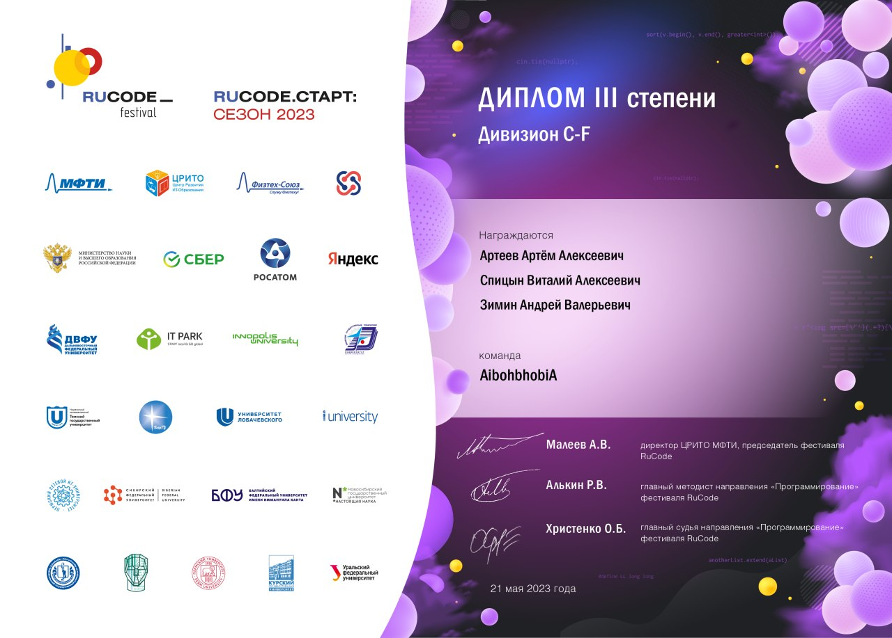
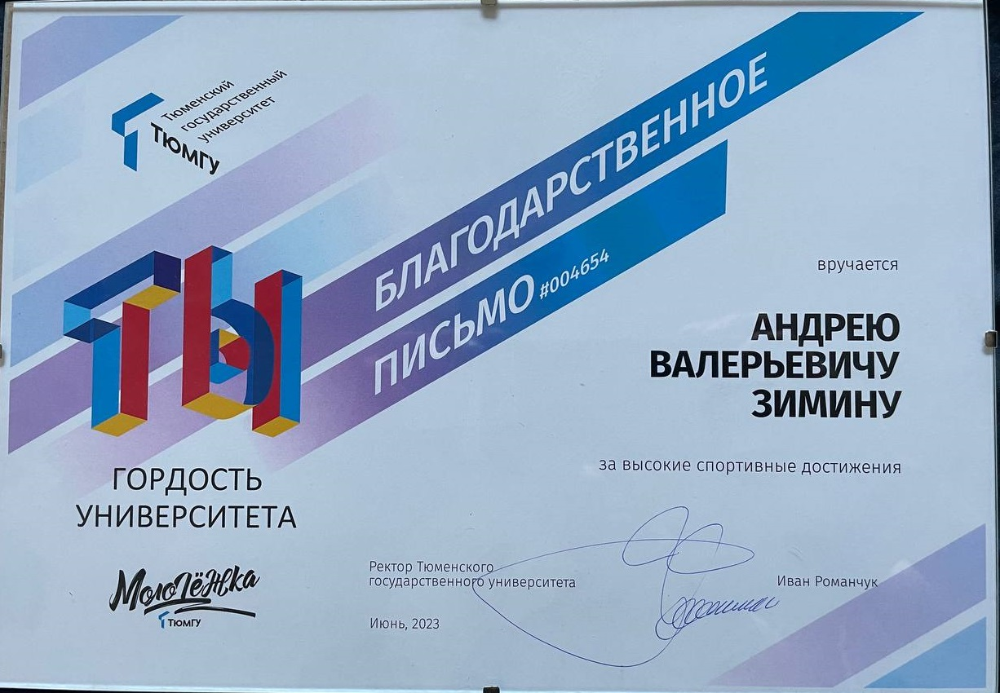

# Championships
Some achievements.

## Sixth ATP ^IMKN

Place: 17
Date: 30.09.2022

## Handicap tournament GO lifeline

Plase: 11
Date: 09.10.2022

## UTMN student's championship

Plase: 2
Date: 11.12.2022

## VIII Ural Polymetall cup

Plase: 56
Date: 18.12.2022

## Spring stars

Plase: 6
Date: 19.03.2023

## Ural Federal District Championship

Plase: 19
Date: 07.05.2023

## Rucode festival

Plase: 3
Date: 21.05.2023

## You are the pride of the university

Date: 28.06.2023

